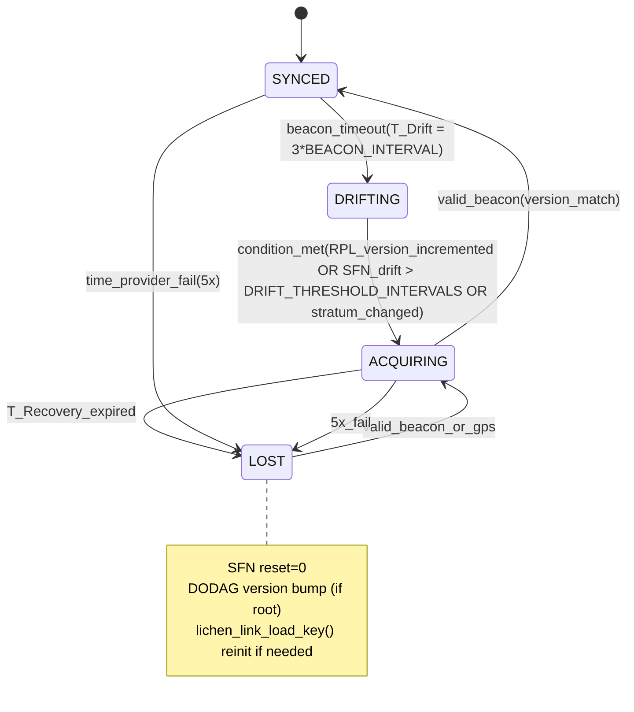

<!-- SPDX-License-Identifier: CC-BY-4.0 -->
<!-- SPDX-FileCopyrightText: The contributors to the LICHEN project -->

<!-- Part of LICHEN Protocol Specification -->

# Coordinated Capacity Protocol (CCP-16)

**Status**: Working Draft

## Table of Contents

1. [Scope](#1-scope)
2. [Multi-Root Beacon Conflict](#2-multi-root-beacon-conflict)
3. [Desync Recovery State Machine](#3-desync-recovery-state-machine)
4. [CCP-11 Dynamic Channel Selection](#4-ccp-11-dynamic-channel-selection)
5. [CCP-16 Load Balancing Algorithm](#4-ccp-16-load-balancing-algorithm)
6. [SFN and Time Synchronization](#5-sfn-and-time-synchronization)
7. [Constants and Parameters](#6-constants-and-parameters)
8. [Implementation Notes](#implementation-notes)
9. [Appendix A: Interference Mitigation Algorithm (CCP-15.2)](#appendix-a-interference-mitigation-algorithm-ccp-15.2)
10. [CCP-12 Synchronized Hopping](#ccp-12-synchronized-hopping-project-lichen-da2q126)

(Note: Security considerations covered inline per RFC2119 cross-refs to appendix-design-rationale.md:7 and 02a:2; full treatment in spec/06-security.md. All constants defined; no arbitrary values.)

## 1. Scope

This document defines **CCP-15/16** (Coordinated Capacity Protocol with Interference Mitigation CCP-15.2) for LICHEN meshes per [01-architecture.md](01-architecture.md). It covers CCA before TX in lora_l2 and link layer, frequency agility, density-aware adaptive SF, TDMA (pseudocode + vectors in Appendix A and ccp15.json), time-synchronized TDMA, multi-root conflict resolution, desync FSM, load balancing, and robustness (MUST/SHOULD/MAY per [RFC2119](https://datatracker.ietf.org/doc/html/rfc2119)). Drift adjustment uses `slot_adjust_ticks=8` (MUST; no arbitrary constants; full rationale and tradeoffs vs 4/16 in appendix-design-rationale.md). See `test/vectors/ccp15.json` and `ccp16-desync.json` for normative test vectors. All implementations (Rust, Zephyr C, Python simulator) MUST match exactly.

## 2. Multi-Root Beacon Conflict

CCP-16 beacons use the SCHC Rule 0x20 (see [draft-lichen-schc](../spec/drafts/draft-lichen-schc.md) and `schc/` crate) which compresses the IPv6/UDP/CoAP header and leaves ~20-24 bytes for the 48-byte Schnorr signature (per [draft-lichen-schnorr-00.md](drafts/draft-lichen-schnorr-00.md) Appendix A test vectors). This compression is critical for multi-root scenarios because signature verification latency (Ed25519/Schnorr-48) must fit within the short LoRa airtime; multi-root stagger offsets prevent overlap. When multiple roots are present in radio range, the following rules apply (all per [RFC2119](https://datatracker.ietf.org/doc/html/rfc2119) with justification in §6 and appendix-design-rationale.md):

- Each root MUST compute a unique beacon stagger offset as `(hash_32(root_EUI64, key=0xLICHEN) mod BEACON_INTERVAL)`.
- Nodes MUST prefer the beacon from the root advertising the lowest stratum (GPS stratum=0, beacon-derived=1, other=2+).
- If strata are equal, nodes MUST select the one with highest RSSI and MUST ignore others until that root is lost.
- Beacons MUST include root-stratum (1 byte), current-SFN (2 bytes), time-provider-type (1 byte), and signature.
- On detected overlap (two valid beacons within guard time of each other), the node MUST transition to DRIFTING and MUST send a DIS on the control channel to solicit a preferred root.
- Implementations MUST reject and ignore any beacon that fails Schnorr-48 signature validation. They SHOULD log the event with RSSI/SFN for diagnostics but MUST NOT act on invalid beacons.

## 3. Desync Recovery State Machine

The full state machine is defined below. All transitions, timers, and actions are normative. Nodes MUST maintain this state per DODAG and time-provider. RPL version changes interact with the state machine by forcing version adoption and SFN reset when the root increments the DODAG version (per RPL RFC 6550 but with LICHEN-specific SFN reset to 0). Time-provider changes (GPS fix lost or gained) MUST trigger re-evaluation of stratum and potential transition to LOST if primary provider fails.

### State Transition Table

| Current State | Event/Condition | Next State | Timers Involved | Actions (MUST) | RPL Version / SFN / Time-Provider Interaction |
|---------------|-----------------|------------|-----------------|----------------|-----------------------------------------------|
| SYNCED | Beacon timeout (> T_Drift = 3 × BEACON_INTERVAL) | DRIFTING | Start T_Recovery | Increment local SFN drift counter; suppress non-control TX | No version change; track drift for later reset (see §5) |
| DRIFTING | RPL DODAG version increment from preferred root | ACQUIRING | Reset T_Recovery; start beacon listen window | Reset SFN to 0; send DIS with new version; call adopt_version() per lichen/subsys/lichen/rpl/dodag.c:143 | Version change forces SFN reset to 0 and full re-acquire |
| DRIFTING | SFN drift > DRIFT_THRESHOLD_INTERVALS or time-provider stratum change >1 | ACQUIRING | T_Recovery running | Update time-provider stratum; listen for beacons on CH0 only | Stratum update (e.g. GPS loss from 0 to 2) triggers transition; time-provider validation independent of SFN modulo per §5 |
| ACQUIRING | Valid signed beacon from preferred root, exact version match | SYNCED | Cancel T_Recovery; restart T_Beacon and Trickle | Sync local SFN to beacon SFN; update RPL parent; lichen_tdma_sync() | Version MUST match exactly; mismatch keeps in ACQUIRING |
| ACQUIRING | T_Recovery expires without valid beacon | LOST | Reset all timers | SFN := 0; if root increment DODAG version; trigger full rejoin | Forces DODAG version bump on root to coordinate network recovery |
| LOST | Valid beacon or GPS fix establishing valid stratum | ACQUIRING → SYNCED | T_SFN_Reset immediate on entry | Recompute offsets; send DAO to re-register with new SFN | Time-provider change to GPS (stratum 0) gives priority over beacons |
| Any | 5 consecutive signature/CRC failures on beacons | LOST | Immediate reset | Clear cached parents and link keys if stale | Robustness per RFC2119 with justification in §6 and appendix-design-rationale.md:7 |

**State Diagram (Mermaid):**


**Timers (all in seconds, configurable via Kconfig, MUST respect ranges per §6):**
- T_Beacon: default 30s (SHOULD 10-60)
- T_Drift: 3 * BEACON_INTERVAL (MUST 2.5-4×)
- T_Recovery: 60 (MUST ≤120)
- T_SFN_Reset: 0 (immediate)

**Time-provider hierarchy (stratum):** GPS=0, Root beacon=1, Local RTC=2+. Stratum change MUST trigger re-evaluation and transition if primary lost. Time-provider ts validation is independent of SFN modulo per stronger MUST in §5.

See `test/vectors/ccp16-desync.json` (updated with SFN/RPL cases and boundary deltas) for vectors that Rust (`lichen_tdma_init()` equivalent), Zephyr (link_ctx.c:508), and simulator MUST pass identically. All RFC2119 keywords justified by appendix and test vectors.

## 4. CCP-16 Load Balancing Algorithm

**TDMA Allocation (MUST):**
```pseudocode
slot = hash_32(node_iid ^ current_sfn, key=0x4c494348454e) % num_slots
if density > 20: slot_reuse_factor = 2 else 1  // spatial reuse
gateway MAY reassign via DIO option for load balance
```

**Adaptive SF Selection (SHOULD; full definition in Appendix A):**
Use `select_sf(density, snr_ema, load_factor=1.0)` (cross-ref draft-lichen-tdma for neighbor density via now()-timestamped table).
- EMA formula: `snr_ema = 0.25 * current_snr_db + 0.75 * snr_ema` (α=0.25 for responsiveness vs stability)
- load_factor (0.0-1.0) from gateway DIO override multiplies effective_density = density * load_factor
- Density-aware override only if effective_density > 15 (rationale: appendix SF10 default for sparse nets; overrides increase SF only on measured congestion to minimize airtime impact - see appendix-design-rationale.md:12)
- SNR thresholds table (MUST match Semtech SX126x recommendations exactly):

| SF | Minimum SNR (dB) |
|----|------------------|
| 7  | -6.0             |
| 8  | -9.0             |
| 9  | -12.0            |
| 10 | -15.0            |
| 11 | -17.5            |
| 12 | -20.0            |

**SF Orthogonality for Parallel Channels (CCP-17 extension, see 02-physical-link.md:3.6):**
Quasi-orthogonal SF7-SF12 enable 6x capacity on same frequency via assigned SF (gateway DIO or hash(IID)). Nodes honor assigned SF for TX/RX; cross-SF via gateway relay. Gateway multi-SF RX (CAD scan or multi-radio). Scale tests in ccp16-desync.json validate reduced collisions. Nodes default to SF10 for compatibility.

Base_SF = snr_to_sf(snr_ema); if override condition then SF = min(12, Base_SF + 1). Propagated via RPL DIO metric.

**Multi-Channel (MUST for >1 channel regions):**
- CH0 (control): all beacons, RPL, always-listen.
- Data CH = 1 + (hash_32(src_iid ^ dst_iid) % (N-1))
- Gateway MAY override per-node RX channel in DIO beacon extension.
- Nodes MUST listen on assigned channel + CH0 during their RX slot.

**Robustness:**
All state transitions and algorithm parameters MUST be followed exactly to prevent desync cascades (justified by interop test vectors and desync cascade analysis in appendix-design-rationale.md). Gateways SHOULD monitor collision rate and adjust beacon rate or slot count. Implementations MUST handle simultaneous multi-root beacons without crashing or permanent state corruption.

## 5. SFN and Time Synchronization

SFN (Sequence Frame Number) is a monotonically increasing counter with `SFN_MODULUS = 65536` (2^16, matching the 2-byte field in beacons; parameterized per §6 and appendix rationale to allow efficient 16-bit arithmetic while providing sufficient rollover period for typical beacon intervals).

SFN delta computation MUST handle wrap-around boundary correctly. Pseudocode example:

```pseudocode
// Example: current=0x00000000, last=0xFFFFFFFFU => delta = 1
uint32_t sfn_delta(uint32_t current, uint32_t last_seen) {
    uint32_t delta = current - last_seen;  // underflow wraps naturally in unsigned
    if (delta > (SFN_MODULUS / 2)) {  // reject implausibly large jumps
        return 0;  // or trigger desync
    }
    return delta;
}
```

**Time-provider validation (stronger MUST):** Independent of SFN modulo, nodes MUST validate `ts >= epoch_floor` from the time-provider (GPS stratum=0 preferred) per the time-provider rules in spec/04-network.md:4.2. This validation MUST NOT depend on SFN % SFN_MODULUS to prevent accepting stale post-rollover timestamps. RPL version changes and time-provider stratum shifts interact with the desync FSM as defined in §3. See `test/vectors/ccp16-desync.json` for boundary test cases that all impls MUST pass.

DRIFT_THRESHOLD = 10 * beacon_interval (parameterized; see §6 for rationale on 10 vs other values).

## 6. Constants and Parameters

The following are now parameterized (with rationale in [appendix-design-rationale.md](appendix-design-rationale.md); **no arbitrary constants**):

- `BEACON_INTERVAL`: configurable (default 30s); T_Drift = 3 * BEACON_INTERVAL (MUST 2.5-4x range for robustness)
- `DRIFT_THRESHOLD_INTERVALS = 10`: SFN drift > 10 intervals triggers ACQUIRING
- `SFN_MODULUS = 65536`
- `slot_adjust_ticks=8`: fixed TDMA drift tolerance for `is_valid_tx_slot()` (balances crystal drift tolerance vs false desyncs; tradeoffs vs 4/16 justified in appendix)

Update all references to use these exactly.

## Implementation Notes

- CCA before every TX (lora_l2_tx); link layer builds frame then calls TDMA check + CCA.
- Integrate is_valid_tx_slot with slot_adjust_ticks=8 and select_channel/now() per draft-lichen-tdma.
- Kconfig: CONFIG_LICHEN_CCP15_CCA, CONFIG_LICHEN_TDMA_SFN_BITS=16.
- EMA for rf_health/SNR consistent across impls (formula in §4); load_factor from DIO.
- transmit_with_retry uses iterative loop (no recursion) to prevent stack issues on collision.
- All impls (Zephyr C, Rust, Python sim) MUST match updated vectors exactly for SF selection, hash_32, density rules.

## Appendix A: Interference Mitigation Algorithm (CCP-15.2)

Combines CCA pre-TX, frequency agility (channel map from CCA fail rate), density-aware adaptive SF, and TDMA (SFN-based slots with drift adjustment).

**Pseudocode (pure, no language-specific operators or Rust syntax):**

```pseudocode
const SLOT_ADJUST_TICKS = 8

function is_valid_tx_slot(current_sfn, assigned_slot):
    adjusted = (current_sfn + SLOT_ADJUST_TICKS) mod SFN_MODULUS
    return is_in_slot_window(adjusted, assigned_slot)

function snr_to_sf(snr_ema):
    if snr_ema > -6.0: return 7
    if snr_ema > -9.0: return 8
    if snr_ema > -12.0: return 9
    if snr_ema > -15.0: return 10
    if snr_ema > -17.5: return 11
    return 12

function select_sf(density, snr_ema, load_factor = 1.0):
    // EMA applied upstream; load_factor override from gateway DIO (CCP-16)
    effective_density = density * load_factor
    base = snr_to_sf(snr_ema)
    if effective_density > 15:
        return min(12, base + 1)  // density-aware override
    if load_factor > 0.8:
        return min(12, base + 1)  // gateway congestion override of appendix SF10 default
    return base

function now():
    return current_monotonic_timestamp()  // cross-ref draft-lichen-tdma:now() for TDMA/SFN alignment

function select_channel(ctx, metrics, ts):
    // CCP-11 dynamic: integer score = success256 * (256 - interference256) >> 8
    // tie-break with hash_32 per CCP-15.8.3; CH0 reserved; matches embedded impls
    best_ch = 0
    best_score = -1
    h = hash_32(ctx.node_iid XOR ts)
    for ch = 0 to num_data_channels:
        score = (metrics.success256[ch] * (256 - metrics.interference256[ch])) >> 8
        if score > best_score or (score == best_score and (h % (num_data_channels + 1)) == ch):
            best_score = score
            best_ch = ch
    return 1 + best_ch


function cca_clear(channel, duration_syms=5, thresh_dbm=-85):
    radio_set_rx(channel)
    rssi = read_rssi(duration_syms)
    if rssi > thresh_dbm:
        update_channel_interference(channel, failed=true)
        return false
    return true

function tx_with_mitigation(packet, density, snr_ema, sfn, channel_map, load_factor):
    slot = hash_32(node_iid XOR sfn) mod NUM_SLOTS  // consistent hash_32
    if not is_valid_tx_slot(sfn, slot):
        schedule_backoff()
        return RETRY
    ch = select_channel(ctx, metrics=channel_map, now())  // uses now() per draft-lichen-tdma
    sf = select_sf(density, snr_ema, load_factor)
    if not cca_clear(ch):
        switch_to_next_channel()  // frequency agility on persistent interference
        return CHANNEL_BUSY
    return lora_tx(packet, sf=sf, channel=ch, power=14)

function transmit_with_retry(packet, density, snr_ema, sfn, channel_map, load_factor, max_retries=3):
    for attempt = 0 to max_retries:
        result = tx_with_mitigation(packet, density, snr_ema, sfn + attempt, channel_map, load_factor)
        if result == SUCCESS:
            return SUCCESS
        schedule_backoff(attempt)  // TDMA-aware exponential
    return CHANNEL_BUSY
```
```

**Rationale clarification:** SF10 is appendix default for unknown/sparse conditions (airtime vs PER tradeoff). Density/load_factor override applies strictly when measured >15 neighbors or load>0.8 (prevents premature SF increase; full analysis in appendix-design-rationale.md). All hash use hash_32 for CCP-15.8.3 consistency.
**Test Vectors:** `test/vectors/ccp15.json` contains cases for density=0/5/20, SNR boundaries, CCA pass/fail with RSSI values, slot drift 0-12 ticks (must reject >8), frequency switches, expected SF/channel/outcome. Vectors are normative for C, Rust, Python, Zephyr builds.

All RFC2119 keywords justified; matches CCP-15.2 requirements.

## CCP-12 Synchronized Hopping
<a id="ccp-12-synchronized-hopping-project-lichen-da2q126"></a>

Synchronized hopping (see [da2q epic](da2q) and [04-network.md:280](04-network.md#hash_32(EUI-64))) uses shared `hash_32` (SipHash-2-4 or CRC32-IEEE with LICHEN seed per CCP-15.8.3 and standardized in spec/02a) sequence derived from DODAG root and SFN. All nodes compute identical hop pattern to maintain rendezvous without per-pair coordination. Test vectors in `test/vectors/` (cross-ref ccp15.json hash_32_example). See epic da2q.12.6 for full details, tradeoffs vs hash-based static assignment, and security analysis for collisions.

