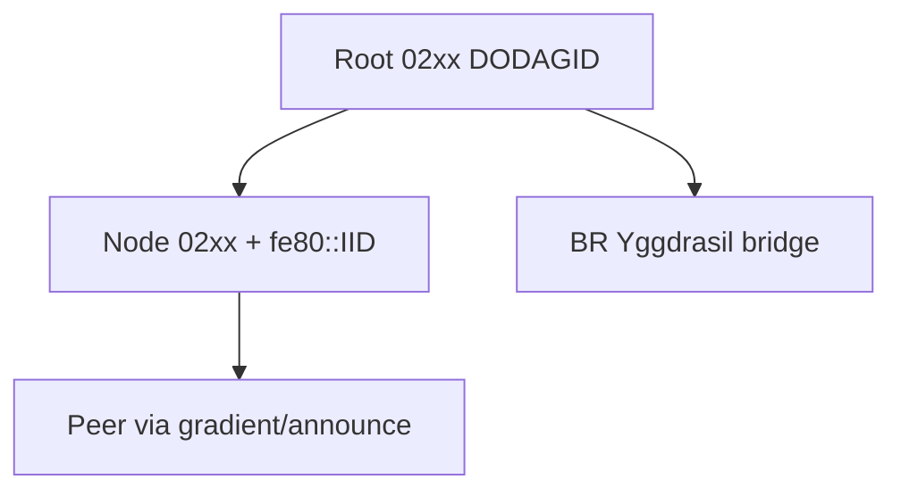

<!-- SPDX-License-Identifier: CC-BY-4.0 -->
<!-- SPDX-FileCopyrightText: The contributors to the LICHEN project -->

<!-- Part of LICHEN Protocol Specification -->

# Network Layer

## 6. Network Layer

### 6.1. IPv6 Addressing (updated for no-ULA model)

**Design Principles (new model):**
- Primary address derived from node's Ed25519 public key (Yggdrasil-compatible 02xx::/7)
- Link-local (fe80::/10) **control-plane only** (NDP, RPL DIO/DAO, LCI)
- No ULA; single primary unicast address works for both local mesh (via RPL) and global (via Yggdrasil gateways)
- Isolated meshes work (self-elected root uses 02xx for DODAG)
- Multiple BRs tolerated; Yggdrasil DHT handles global routing
- Unified identity: same Ed25519 keypair for link signatures, OSCORE, and IPv6 address (see 06-security.md)

**Simplified Addressing (link-local + Yggdrasil-derived 02xx only):**

Per zt3c/nqz6: Drop all ULA (fd00::/8) and optional GUA. Nodes have exactly two addresses:

| Address | Prefix | Scope | Use |
|---------|--------|-------|-----|
| Link-local | fe80::/10 | Link | NDP, RPL control, neighbor discovery, LCI only |
| Primary unicast | 02xx::/7 | Global | All application traffic, mesh routing, Yggdrasil global |

**Unified Ed25519 Identity Derivation (see 06-security.md for full spec):**

All node identity derives from a single Ed25519 keypair:
- Signatures (link and Schnorr48)
- OSCORE contexts
- IID (8 bytes, from SHA-512(pubkey) with U/L bit clear)
- 02xx address (Yggdrasil-compatible derivation: SHA-512(pubkey) truncated with 0x02 prefix)

**Why this simplification?**
- 02xx works locally without Yggdrasil daemon (routed via local RPL/gradient if peer in mesh)
- Eliminates "which address to use" logic and multiple address state
- Stable global addresses even in isolated meshes
- Gateways bridge 02xx to Yggdrasil backbone for inter-mesh

**Link-Local:**
```
fe80::<IID>
```
Used exclusively for control plane. Application traffic uses the 02xx address.

**Isolated Meshes (No Border Router, no-ULA model):**



Mesh uses exclusively self-derived 02xx addresses (unified Ed25519 derivation per 06-security.md:109) and link-local. No ULA prefix generated/advertised (PIO proposal at python/src/lichen/schc/rules.py:272, 03-adaptation.md:184). DODAGID = root's 02xx address. RPL non-storing uses DAOs + 6LoRH for downward.

**Root Election:**
- Any router MAY self-elect as DODAG root.
- Criterion: lowest IID (derived from Ed25519 key per unified derivation).
- No PIO for prefix (no ULA; PIO proposal in SCHC rules at rules.py:272, 03-adaptation.md:215).
- BR appearance preferred via lower rank/metrics.

**Root Failure Detection:**

Nodes monitor DIOs from root.

| Condition | Action |
|-----------|--------|
| No DIO for 3× Imax | Root unreachable |
| No alternate path | Initiate re-election |

Re-election:
1. Next-lowest-IID node waits random delay (0-5s).
2. No DIO => self-elect, advertise DIO with 02xx as DODAGID.
3. Others stand down.

**Root Demotion:**

For misbehaving root (incl. failure to process DAOs):

| Misbehavior | Evidence |
|-------------|----------|
| Selective forwarding | E2E ACK failures |
| Rank manipulation | Inconsistent topology |
| Resource exhaustion | Stops responding to DAO/control |

Demotion uses broadcast DEMOTION_REQUEST (ICMPv6) with target IID (8 bytes), evidence, Schnorr signature. Requires >50% consensus. Demoted node cooldown 1 hour. Update uses IID not EUI-64 for consistency with no-ULA model.

**Multiple Border Routers:**

Supported without coordination. Each BR forms DODAG; nodes select best. Global reachability via Yggdrasil bridging at BR (no per-prefix GUA state in nodes). Route selection prefers 02xx paths.

### 6.2. Interface Identifier (IID) Derivation

**Unified from Ed25519 public key (per zt3c.1 and 06-security.md):**

```
pubkey (32 bytes) --SHA-512--> hash[0:8] with U/L bit cleared (bit 1 = 0)
```

Exact algorithm (to be detailed in security spec and test vectors):

1. Compute SHA-512 of the Ed25519 public key.
2. Take first 8 bytes of hash.
3. Clear the U/L bit (IID[0] &= ~0x02) for consistency with modified EUI-64 convention.
4. The same derivation produces the 02xx address prefix bytes.

This unifies all identity elements (key, signatures, OSCORE, IID, global address) to a single Ed25519 keypair per node. No dependence on hardware EUI-64 for addressing (though EUI may still be used for initial key provisioning or board identity).

**Stable IIDs only.** Rotating or privacy IIDs are prohibited; all protocol mechanisms (RPL, gradients, replay protection, TOFU, OSCORE) depend on stable key-derived identity. See 06-security.md for privacy analysis. Short addresses (for 6LoWPAN compression) are derived secondarily from the IID.

### 6.3. Multicast and Broadcast

#### 6.3.1. Multicast Scopes

IPv6 multicast addresses encode scope in bits 8-11:

| Scope | Value | Address Prefix | Meaning |
|-------|-------|----------------|---------|
| Interface-local | 1 | ff01:: | Loopback only |
| Link-local | 2 | ff02:: | Single hop (direct neighbors) |
| Mesh-local | 3 | ff03:: | Within DODAG (LICHEN extension) |
| Site-local | 5 | ff05:: | Administrative domain |
| Global | 14 | ff0e:: | Internet-wide |

**Standard multicast groups:**

| Address | Scope | Usage |
|---------|-------|-------|
| ff02::1 | Link-local | All nodes (1 hop) |
| ff02::1a | Link-local | All RPL nodes (1 hop) |
| ff02::2 | Link-local | All routers (1 hop) |
| ff03::1 | Mesh-local | All nodes (entire mesh) |
| ff03::fc | Mesh-local | All LICHEN nodes |

#### 6.3.2. Hop-Limited Broadcast

For scoped flooding without full multicast routing, use **Hop Limit**:

| Hop Limit | Reach | Use Case |
|-----------|-------|----------|
| 1 | Direct neighbors | Discovery, link probing |
| 2 | 2 hops | Local announcement |
| 3-4 | Small cluster | Team coordination |
| 5-7 | Mesh diameter | Mesh-wide alert |
| 255 | Unlimited | Flood (bounded by topology) |

**How it works:**

1. Sender sets Hop Limit (e.g., 4)
2. Sender broadcasts to ff03::1 (mesh-local all nodes)
3. Each relay:
   - Receives packet
   - Decrements Hop Limit
   - If Hop Limit > 0: rebroadcast
   - If Hop Limit = 0: consume locally, don't relay

No routing table consulted. Purely local decision at each hop.

#### 6.3.3. Broadcast Rate Limiting

Broadcasts are expensive -- each packet is relayed by every node in range.
Without limits, a single node can flood the network.

**Distributed rate limiting (no central authority):**

Each node tracks broadcasts it relays, per sender:

```
Broadcast Relay State:
  sender_iid: <IID of original sender>
  hop_bucket[1-7]: <count in rolling 1-hour window>
  last_seen: <timestamp>
```

**Hop-aware budgets:**

Higher Hop Limit = larger blast radius = stricter limit:

| Hop Limit | Budget (per sender per hour) | Rationale |
|-----------|------------------------------|-----------|
| 1 | 200 | Neighbors only, low impact |
| 2 | 100 | Small radius |
| 3-4 | 30 | Medium radius |
| 5-7 | 10 | Mesh-wide, expensive |
| SOS (any) | 3 | Emergency, always relay once |

**Relay decision:**

```
on_receive_broadcast(packet):
  sender = packet.source_iid
  hl = packet.hop_limit

  if sender not in relay_state:
    relay_state[sender] = new_entry()

  budget = get_budget(hl)
  count = relay_state[sender].hop_bucket[hl]

  if count >= budget:
    drop(packet)  # sender exceeded budget
    return

  if count >= budget * 0.5:
    # Probabilistic relay in yellow zone
    if random() > 0.5:
      drop(packet)
      return

  relay_state[sender].hop_bucket[hl] += 1
  decrement_hop_limit(packet)

  if packet.hop_limit > 0:
    rebroadcast(packet)
```

**Properties:**

- **No coordination:** Each node enforces independently
- **No network map:** Only local state per sender
- **Spammers isolated:** Immediate neighbors stop relaying
- **Graceful degradation:** Probabilistic relay in yellow zone
- **Memory bounded:** Expire old entries after 2 hours idle

**State size:**

Per-sender entry: ~20 bytes (IID + 7 bucket counters + timestamp)
At 100 active senders: ~2 KB

#### 6.3.4. Border Router Multicast Filtering

Border routers MUST NOT forward mesh multicasts to the internet:

| Direction | Unicast | Multicast |
|-----------|---------|-----------|
| Mesh → Internet | Forward (route normally) | **Drop** |
| Internet → Mesh | Forward (route normally) | **Drop** (unless explicit config) |

Rationale:
- Mesh broadcasts are not meaningful globally
- Prevents accidental flood amplification
- Protects mesh from external multicast storms

**Exception:** Explicitly configured multicast peering between meshes
(future work -- requires multicast routing protocol like PIM).

### 6.4. ICMPv6

Standard ICMPv6 (RFC 4443) for:
- Echo Request/Reply (ping)
- Destination Unreachable
- Packet Too Big
- RPL control messages (see Section 7)

---

## 12. Addressing

See [03-addressing.md](03-addressing.md) for the complete human-readable Crockford base32 node address specification, derivation, test vectors, and IID integration.

### 12.1. Address Structure

Summary (simplified per nqz6/zt3c):

```
Link-local:  fe80::<IID>          (control plane only)
02xx:        02xx:...::<IID>      (primary unicast address for all traffic)
```

The 02xx address is Yggdrasil-derived from the node's Ed25519 public key (unified identity, see spec/06-security.md). IID is also derived from the same pubkey via SHA-512 truncation (U/L bit cleared). No ULA or additional GUA addresses.

### 12.2. Example Addresses

| Type | Example | Use |
|------|---------|-----|
| Link-local | fe80::0201:0203:0405:0607 | NDP, RPL, discovery |
| Primary | 0201:0203:0405:0607:0809:0a0b:0c0d:0e0f | All app/mesh/global traffic |

02xx works for local mesh routing without Yggdrasil (local preference in routing table). Gateways provide global reachability via Yggdrasil backbone.

### 12.3. Short Address Assignment

16-bit short addresses optimize 6LoWPAN compression (2 bytes vs 8). See 02-physical-link.md:202 (SipHash-2-4(key=0x4c494348454e) per 02a-coordinated-capacity.md; no CRC16; FNV retained per bo37/vfl0) for detailed pseudocode, DAD retry strategy (higher collision probability vs prior CRC16), coordinator binding to pubkey-derived IID, and collision safety net.

Assignment methods (no central authority required):
1. **hash_32(EUI-64, 0) derived (SipHash-2-4):** Truncate lower 16 bits, verify via DAD with enhanced retry (5+ probes)
2. **Self-assigned + DAD:** Preferred for isolated meshes per above
3. **DODAG root/coordinator assignment:** Authoritative allocation from pubkey (preferred when BR present)

Short addresses are mesh-local; they compress the IID for routing efficiency
but the full IID remains the stable identifier for security (key binding).

---

[← Previous: Adaptation Layer](03-adaptation.md) | [Index](README.md) | [Next: Routing →](05-routing.md)
